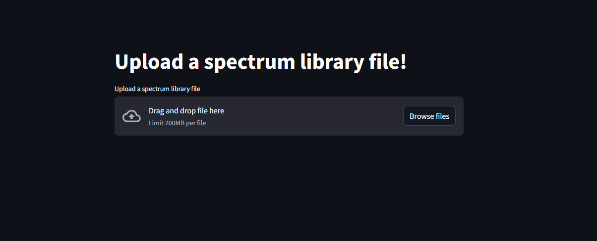
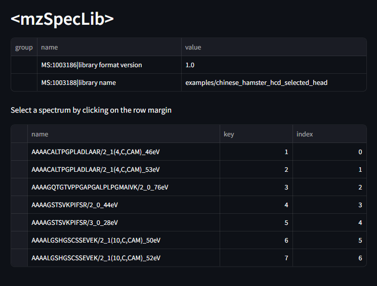
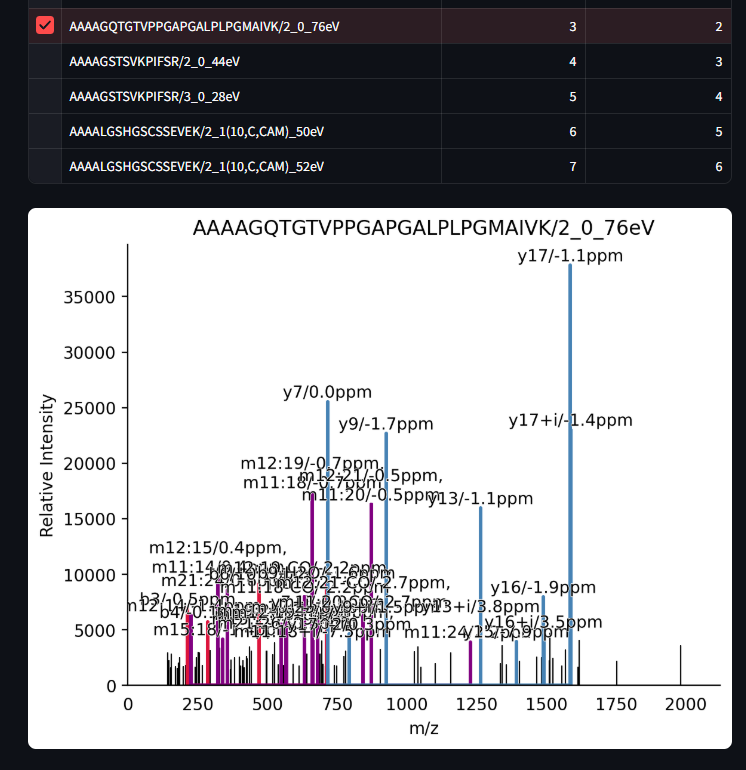
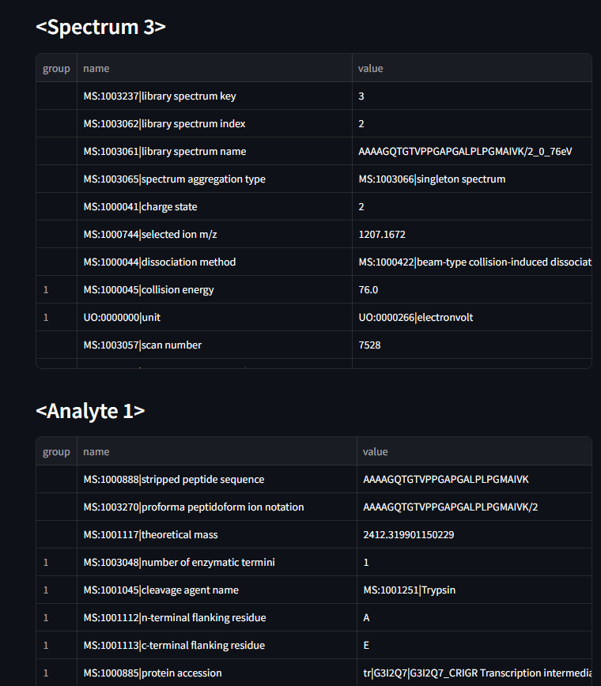

A `streamlit` viewer for `mzspeclib` files

## Usage

To launch the viewer, install `mzspeclib` and `streamlit`

```bash
$ streamlit run viewer/viewer.py
```

### This will start the server and open the web browser.



### Select a spectrum library file.



### Click in the margin on a row in the spectrum table to view a spectrum


